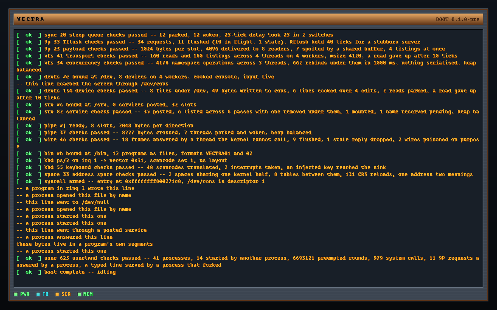

# Vectra

A modular operating system written in Odin. Plan 9-inspired namespaces and a
synthetic file protocol underneath, a skeuomorphic 1994-cyberpunk workstation
on top.

## Status

**A client draws into a window now, and everything else still runs.** The kernel
comes up under Limine on `x86_64` with descriptor tables, page tables and a
heap of its own. It comes up on `aarch64` and `riscv64` too, on QEMU's
`virt` board, through the same `kmain`: the ports have their own trap paths,
page tables, timers and interrupt controllers, and run one self-test suite,
ring 3 programs included. `docs/PORTS.md` has the table. It publishes `#c` at `/dev`, `#s` at `/srv`, `#e` at `/env` and `#b` at
`/bin` over 9P2000.L. It preempts on the local APIC and takes keyboard
interrupts through the I/O APIC.

Then it starts processes in ring 3 that open files by name and write to the
console. Those processes spawn children out of files under `/bin`, wait for
them, and collect their exit status. One posts a service in `/srv` and mounts
the name it published -- Plan 9's way, create the file and write a descriptor
into it. One *answers* 9P by hand, in a page of Odin.

And what runs can now be stopped. A *note*, posted from the kernel or from a
parent to its own child, ends a process at the next kernel boundary it
crosses. The tick catches a runaway loop, the door catches a call, and an
unwound sleep catches a server parked on its pipe.

And one is `servers/ramfs`, an Odin program the build driver compiled for ring 3. Its
segments load with real permissions, and it serves a file tree through the
same codec the kernel links. The kernel mounts it, reads a file out of the
program's rodata, and writes one into its bss.

A process is an address space, a namespace and a set of open files. Two
processes can hand the kernel one path and get different files. The mount
table belongs to the process rather than to the machine, and a child resolves
its paths in the world its parent arranged.

**The screen is memory a process holds.** `servers/intuition` opens `/dev/fb`,
attaches it as a device segment, and paints the glass through stores rather
than through a write per row.

Image zero is the session's *window*, not the screen. Every draw moves by the
window's origin and clips to its extent, so two clients hold the same
coordinates and mean two places. The draw protocol did not change to make that
true.



The second half of a boot, on the machine's own framebuffer, drawn by the
console this kernel owns. The tagged lines are self-tests. The untagged ones
are programs in ring 3, writing through `/dev/cons`.

The log is about forty lines and every one of them is a self-test. The screen
holds thirty-six, so the picture starts partway down. `docs/HANDOFF.md` has the
whole thing in text, where it can be searched and diffed.

### Seven of those lines are worth explaining

`-- a program in ring 3 wrote this line` crosses every layer there is. The
`syscall` instruction. A copy out of a program's memory that the kernel checked
first. A 9P write over the real transport, the `#c` device server, and the
framebuffer console.

`-- this line went to /dev/null` is the one that is not there. A process bound
`/dev/null` over `/dev/cons` **in its own namespace**. Then it wrote the same
line twice, once by that path and once through a descriptor it opened before
the bind. The console moved once, and nothing else on the machine saw the
change.

`-- a process started this one` came from a program the kernel did not
start. A parent process named `/bin/child` in its own namespace, and the
kernel loaded the file and ran it. The parent then bound `/dev/null` over
`/dev/cons` and spawned the same file again. Both children ran and reported
the same status to their parent's `wait`. The line appeared once.

`-- this line went through a posted service` reached the screen by a name no
kernel put anywhere. A process opened `/dev/cons`, created `/srv/cons2`, and
wrote its descriptor's digit into it. Then it mounted the name it had just
published at `/mnt` in its own namespace. Then it removed the name and kept
using the mount, because removal ends the name rather than the service.

`-- a process answered this line` is the newest, and the direction is the
point. The *kernel* wrote it, as a 9P client of a service a program
implements. `/bin/niner` made a pipe, posted one end in `/srv`, and served the
other by hand. It answered version, attach, walks and an open, forwarded this
write to the console, and served a read from its own text. The remove told it
to stop. The layout this project is named for -- servers as programs -- now
has its transport.

`these bytes live in a program's own segments` is the newest, and the bytes
kept every promise in their path. They were a string in `servers/ramfs`, an
ordinary Odin package the build driver compiles, links at a fixed address,
and converts to a flat segment image. The loader mapped them read-only in a
rodata segment. The program served them over 9P through the handler shape
every kernel server uses, and the kernel printed what it read.

`7 spoiled by a shared buffer`, in the full log, is a **pass**. It is a control
that runs on every boot. Eight readers share one reply buffer, the way a 9P
server looked before the payload-per-slot milestone. A failure to corrupt each
other would be the failure.

## What exists

| Subsystem | What it is |
|---|---|
| `boot/`, `kernel/arch/` | Limine, GDT/TSS/IDT, traps, the panic screen |
| `kernel/mem/` | Bitmap PMM, page tables, slab heap behind `context.allocator`, one address space per process |
| `kernel/sched/` | Threads, priorities, decay and boost, the LAPIC tick that preempts |
| `kernel/sync/` | The lock that masks, the lock that parks, and waiting for a condition |
| `sys/vectra9/` | The 9P2000.L message set, its codec, and the transport boundary |
| `kernel/vfs/` | The namespace: chans, the mount table, walking, union listings |
| `kernel/mnt/` | A 9P connection with several requests in flight, `Tflush`, and the wire whose far side is bytes |
| `kernel/pipe/` | A pipe: two ends, a byte ring per direction, and a posted end a mount turns into a server |
| `kernel/devfs/` | `#c` at `/dev`: the console, its line discipline, `/dev/consctl` |
| `kernel/srv/` | `#s` at `/srv`: services published by name while the machine runs, from ring 3 too |
| `kernel/env/` | `#e` at `/env`: a process's environment as a directory of variables, copied or shared by `rfork` |
| `kernel/drivers/kbd/` | PS/2 scancodes, the I/O APIC route, a top half that may not park |
| `kernel/user/` | Ring 3, `syscall`/`sysret`, a process that owns what it opens, and the spawn that makes more |
| `sys/abi`, `sys/libuser` | The call numbers both sides include, and the ring 3 library: syscalls and a 9P serve loop |
| `servers/ramfs` | The first compiled server: an Odin file tree in ring 3 |

`servers/` has its first resident, and `apps/` is still empty. `kernel/devfs`
stays in the kernel for the moment. A console server must wait on the
keyboard and its clients at once, and a ring 3 process cannot wait on two
things yet. The port also wants a note to stop a runaway server, and raw
devices a user process could reach. All three are named, with the rest, in
`docs/HANDOFF.md`.

**`docs/HANDOFF.md` is the orientation document**, and each subsystem has one
of its own beside the code it explains.

## Vectra9

Every system service — drivers, the network stack, graphics, IPC, thread state
— is a file tree behind a message-passing endpoint. The protocol is **9P2000.L,
unmodified**, and keeping it that way is a design constraint. When a service
needs an operation 9P does not have, the answer is a *file*. `/dev/consctl` is
the first, and it takes a line of text.

Servers speak *decoded* messages. The transport is the only thing that knows
bytes exist, so an in-kernel read costs one indirect call and no copy of the
payload. The same handler behind a pipe gets an identical message, because the
transport parsed it first:

```
in-kernel:   caller -- Msg ------------------------> handler
to userland: caller -- Msg -> encode -[bytes]-> decode -> handler
```

The namespace is the full Plan 9 model: `bind`/`mount` with
before/after/replace, union directories, and per-process mount tables copied or
shared on fork. It is built, and ring 3 reaches it through `bind`.

**`docs/VECTRA9.md` is the design**, and the thing to read before touching
`sys/vectra9/`, a server, or the mount model.

## Every line of that boot log is a self-test

There is no test harness and no host-side test build. Every layer proves itself
on the machine that will run it, during boot, and reports one line. About 910
checks run on every boot.

The cost of that is a self-test can be *unfalsifiable* — it passes because it
cannot fail, and nothing about a green line says which. So every milestone ends
by mutating the code, one change at a time, and recording which checks notice.
**The mutations nothing catches are the more interesting half**, and each
subsystem's document lists them rather than files them as gaps.

Four of the things that found:

- A test that FXSAVE preserves XMM registers **passed with the FXSAVE
  removed**. An unoptimised build spills every value to the thread's own stack,
  and a thread's own stack survives by construction.
- A check that a write reached the screen was the driver's byte counter, which
  rises whether or not a glyph is drawn. It is the console's cursor column now,
  and the newline goes in a second write so the number is exact.
- A control that removed the `User` bit from the kernel's copy-in check passed
  everything, because the only bad address the test used was a kernel one and a
  range check refused it first. A program that hands the kernel an address in
  its *own* half that it may not read is what closes it.
- A teardown that freed frames it did not own passed every check, because the
  physical allocator absorbed a double free without a word. It counts them now.

`docs/TESTING.md` is the discipline, and it is short.

## Building

Requires `odin`, `ld.lld`, `qemu-system-x86_64`, and `python3` with Pillow (only
to regenerate the console font). No `xorriso`, no loop devices, and no `sudo`.
The bootable volume is a directory that QEMU's vvfat backend presents to the
firmware as FAT, so the same commands work on macOS and Linux. UEFI firmware
comes from the edk2 images QEMU installs beside itself, unless a combined
OVMF image is supplied.

```sh
just run          # build, stage, boot headless with serial on stdio
just gui          # same, but open a QEMU window
just debug        # boot halted; `just gdb` in another shell
just release      # optimised, bounds checks off
just check        # type-check everything, emit nothing
make run          # if you don't have `just`
```

`build.odin` is the real build system. `justfile` and `Makefile` are wrappers
over it, and its options are documented in the comment at the top of the file.
Invoke it directly as:

```sh
odin run build.odin -file -out:.vectra-build -- run --gfx
```

The explicit `-out:` matters. Without it `odin run` names the driver binary
after the script and drops `./build` right on top of the `build/` output
directory.

## Prose is linted

Comments and documents are written in **ASD-STE100**, the controlled English
the aerospace industry uses for maintenance manuals. `tools/ste-lint.py` checks
the seven rules a program can decide on its own. Sentence length, the
semicolon, the perfect tense, and the passive with a named actor are four of
them. The tree stays at zero findings, and this file is inside it.

```sh
odin run build.odin -file -out:.vectra-build -- lint --show
```

`docs/STYLE.md` says what that costs and why it is worth it.

## Layout

```
build.odin              Build driver: compile, link, stage ESP, run QEMU
boot/                   Bootloader assets staged into the EFI system partition
kernel/
  main.odin             kmain, the Limine requests, and the boot order
  verify_*.odin         The self-tests that span more than one package
  splash.odin           The boot chassis: plinth, copper bar, well, lamps
  log.odin              Kernel log; serial and screen, with replay
  panic.odin            The panic screen and the trap handler behind it
  link_amd64.ld         Static-PIE image layout for the Limine protocol
  arch/                 Architecture interface (arch_amd64.odin binds it)
    amd64/              Port I/O, MSRs, paging, GDT/TSS/IDT, LAPIC, I/O APIC,
                        the per-CPU record behind GS, and the syscall stub
  boot/limine/          Limine protocol bindings and the request delimiters
  drivers/
    uart/               16550 serial, polled
    fb/                 Linear framebuffer surface, bevels, gradients, palette
    console/            Framebuffer text console + baked 8x16 font
    kbd/                PS/2 scancodes, a top half and a bottom half
  mem/                  Bitmap PMM, page tables, slab heap, address spaces
  sync/                 Spinlock, sleeping lock, sleep queue, rendezvous
  sched/                Threads, run queues, the switch, the tick
  vfs/                  Chans, mount table, walking, union listings
  mnt/                  A 9P connection with several requests in flight,
                        and the wire a process answers
  pipe/                 Anonymous pipes, and posted ends as servers
  devfs/                `#c` at /dev
  srv/                  `#s` at /srv
  env/                  `#e` at /env
  user/                 Ring 3, the system calls, a process, the image
                        loader, and `#b` at /bin
sys/
  abi/                  The system call numbers both sides include
  libodin/              Freestanding core shared by kernel and userland
  libuser/              Ring 3: syscall wrappers and a 9P serve loop
  vectra9/              9P2000.L message layer: types, codec, sessions
  libposix/             Not yet written
servers/
  ramfs/                The first compiled server; devfs, netfs, intuition
                        are still to come
apps/                   terminal, filemgr, tracker — not yet written
docs/                   One document per subsystem, plus HANDOFF and TESTING
tools/
  genfont.py            Bakes a host TTF into the console font
  ste-lint.py           The ASD-STE100 checker
```

## Notes on the toolchain

These each cost something to find. `docs/HANDOFF.md` section 5 has the full
list with what breaks when you change one.

- The kernel builds against **stock `base:runtime`**. Odin's freestanding
  target carries its own `os_specific` stubs, so there is no vendored runtime
  shim to keep in sync with the compiler.
- `-no-thread-local` is required. Odin otherwise emits `STT_TLS` symbols with
  no `PT_TLS` segment to put them in, and per-CPU state goes through `GS`
  explicitly instead.
- `ld.lld` does the linking. Apple's `ld` cannot produce ELF.
- The bundled Limine is **v12.6.1** (UEFI applications only). Vectra requests
  **base revision 6**, and `kmain` reports whether it got it.
- Since base revision 2 the request delimiters are binding, not advisory. Every
  request must carry `@(link_section = ".limine_requests")` or the bootloader
  never sees it. It links, it boots, and the response is silently nil.
- Base revision 5 and above clear every `cr0`/`cr4`/`EFER` bit the protocol does
  not require, `CR4.OSFXSR` included. Odin's codegen uses XMM registers for
  ordinary struct moves, so `arch.early_init` enabling SSE is what stops the
  *first* Odin statement after entry from faulting.
- `EFER.NXE` has to be on before the first mapping that sets the no-execute
  bit. Until it is, bit 63 of a page table entry is *reserved* rather than
  ignored. The mapping then faults on first touch, nowhere near the cause.
- The kernel image's segment bounds come from `kernel/link_amd64.ld`, which
  exports `__text_start` … `__data_end`, rather than being restated in Odin.
  The permissions the VMM installs therefore cannot drift out of step with the
  layout the linker produced.
- Entry stubs use `proc "naked"` — a calling convention, not the `@(naked)`
  attribute, which Odin does not have. The assembler emits all 256 interrupt
  stubs with `.rept` and pads each to sixteen bytes with `.balign 16`. Finding
  the nth is then a multiplication rather than a table of function pointers.
- The user selectors in the GDT are laid out `[code32, data, code64]`, which is
  what `SYSRET` reads out of `STAR`. `SYSRET` does not validate what it loads,
  so a wrong layout is not a link error and not a fault at boot. It is a system
  call returning to the wrong privilege level.
- The legacy 8259 PICs are remapped clear of the exception vectors *and* then
  masked. Masking alone leaves a spurious IRQ 7 able to arrive as a page fault
  with a stale CR2, which is a very convincing wrong answer.
- A missing EOI stops the local timer silently. There is no error, no fault and
  no bit anywhere saying so, and it looks exactly like a timer that was never
  armed. Any loop waiting on the tick count needs a liveness bound measured in
  something the failure cannot destroy.
